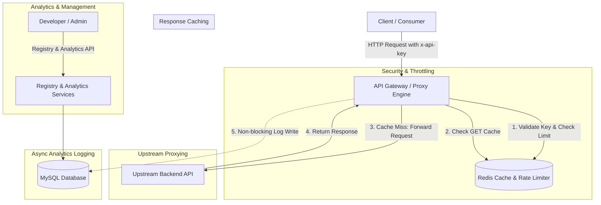

# APIForge — Enterprise API Gateway & Management Platform

[](https://nodejs.org/)
[](https://expressjs.com/)
[](https://redis.io/)
[](https://www.mysql.com/)
[](https://www.docker.com/)

**APIForge** is a high-performance, modular API Gateway and Management Platform built for securing, throttling, caching, proxying, and analyzing microservices and third-party APIs.

---

## 🏗️ System Architecture



---

## ⚡ Core Features

1. **API Registration & Registry**: Register upstream microservices or third-party HTTP targets to receive unique UUID route handlers (`apiId`).
2. **SHA-256 API Key Security**: Generates cryptographically secure API keys (`apiforge_<32-byte-hex>`). Only SHA-256 hashes are persisted in MySQL, ensuring zero vulnerability to raw key exposure in database leaks.
3. **Redis-Backed Atomic Rate Limiting**: Protects upstream services against abuse by tracking per-key request windows using atomic Redis pipelines (`INCR` + `EXPIRE`). Emits standard `X-RateLimit-*` and `429 Too Many Requests` headers with `Retry-After`.
4. **Redis Response Caching**: Accelerates `GET` endpoints by serving cached payloads directly from Redis using deterministic key hashing (`cache:<apiId>:<path>:<sortedQuery>`). Emits `X-Cache: HIT / MISS` response headers.
5. **Asynchronous Request Logging**: Records endpoint path, HTTP method, status codes, and precise execution latency (`latency_ms`) without blocking client response loops.
6. **Analytics Aggregation API**: Real-time aggregation endpoints for monitoring total throughput, error rate percentages, average latency, hourly timeseries buckets, and error logs.
7. **Containerized Deployment**: Ready-to-deploy multi-container orchestration with Docker & Docker Compose (`app`, `db`, `redis`) featuring automated schema migrations on startup.

---

## 🚀 Quick Start Guide

### Prerequisites
* [Node.js](https://nodejs.org/) v18+ 
* [Docker](https://www.docker.com/) & Docker Compose (Recommended)
* MySQL 8.0 & Redis 7.0 (if running locally without Docker)

### Option A: Running with Docker Compose (Recommended)

1. **Clone the repository**:
   ```bash
   git clone https://github.com/manya1106/APIForge.git
   cd APIForge
   ```

2. **Spin up the stack**:
   ```bash
   docker-compose up --build
   ```

The application will automatically start on `http://localhost:3000`, spinning up and configuring containerized MySQL and Redis instances with persistent volumes and health checks.

---

### Option B: Running Locally

1. **Install dependencies**:
   ```bash
   npm install
   ```

2. **Configure environment variables**:
   Create a `.env` file in the project root (see `.env.example`):
   ```env
   PORT=3000
   DB_HOST=localhost
   DB_PORT=3306
   DB_USER=root
   DB_PASSWORD=your_password
   DB_NAME=apiforge

   REDIS_HOST=localhost
   REDIS_PORT=6379
   RATE_LIMIT_MAX=100
   RATE_LIMIT_WINDOW_SEC=60
   CACHE_TTL_SEC=60
   ```

3. **Start the server**:
   ```bash
   node src/app.js
   ```

---

## 📡 API Reference & Usage Workflow

### 1. Register a Target API
**Endpoint:** `POST /registry/apis`

**Request Body:**
```json
{
  "userId": "user_123",
  "name": "Weather Service",
  "targetUrl": "https://api.open-meteo.com/v1"
}
```

**Response (`201 Created`):**
```json
{
  "apiId": "5e81d77a-2420-410d-85f8-2ba45e128178",
  "userId": "user_123",
  "name": "Weather Service",
  "targetUrl": "https://api.open-meteo.com/v1"
}
```

---

### 2. Generate an API Key
**Endpoint:** `POST /auth/keys`

**Request Body:**
```json
{
  "apiId": "5e81d77a-2420-410d-85f8-2ba45e128178"
}
```

**Response (`201 Created`):**
```json
{
  "keyId": "9b1deb4d-3b7d-4bad-9bdd-2b0d7b3dcb6d",
  "apiKey": "apiforge_8f3a91b2c4e5f6a7b8c9d0e1f2a3b4c5d6e7f8a9b0c1d2e3f4a5b6c7d8e9f0a1",
  "message": "Store this key safely. You will not be able to see it again."
}
```

---

### 3. Proxy Request through Gateway
**Endpoint:** `ALL /gateway/:apiId/*`

**Headers:**
```http
x-api-key: apiforge_8f3a91b2c4e5f6a7b8c9d0e1f2a3b4c5d6e7f8a9b0c1d2e3f4a5b6c7d8e9f0a1
```

**Example Request:**
```bash
curl -i -H "x-api-key: apiforge_8f3a91..." \
  "http://localhost:3000/gateway/5e81d77a-2420-410d-85f8-2ba45e128178/forecast?latitude=52.52&longitude=13.41&current_weather=true"
```

**Response Headers:**
```http
HTTP/1.1 200 OK
X-RateLimit-Limit: 100
X-RateLimit-Remaining: 99
X-RateLimit-Reset: 60
X-Cache: MISS
```
*(Subsequent identical GET requests within 60s will return `X-Cache: HIT` instantly without contacting the upstream server).*

---

### 4. Analytics Endpoints

#### **A. Overall Summary**
`GET /analytics/:apiId/summary`

**Response (`200 OK`):**
```json
{
  "apiId": "5e81d77a-2420-410d-85f8-2ba45e128178",
  "totalRequests": 1420,
  "avgLatencyMs": 48,
  "totalErrors": 12,
  "errorRatePercent": 0.85
}
```

#### **B. Hourly Timeseries**
`GET /analytics/:apiId/timeseries`

**Response (`200 OK`):**
```json
{
  "apiId": "5e81d77a-2420-410d-85f8-2ba45e128178",
  "timeseries": [
    {
      "hour": "2026-09-09 01:00:00",
      "totalRequests": 450,
      "avgLatencyMs": 52,
      "errorCount": 3
    },
    {
      "hour": "2026-09-09 02:00:00",
      "totalRequests": 970,
      "avgLatencyMs": 44,
      "errorCount": 9
    }
  ]
}
```

#### **C. Error Logs**
`GET /analytics/:apiId/errors`

**Response (`200 OK`):**
```json
{
  "apiId": "5e81d77a-2420-410d-85f8-2ba45e128178",
  "errors": [
    {
      "id": 104,
      "path": "/forecast",
      "method": "GET",
      "statusCode": 429,
      "latencyMs": 2,
      "createdAt": "2026-09-09T01:15:22.000Z"
    }
  ]
}
```

---

## 🧠 System Design & Technical Trade-offs

### 1. Rate Limiting Algorithm: Fixed Window vs. Sliding Window vs. Token Bucket
* **Chosen Implementation**: Fixed Window with atomic Redis pipelines (`INCR` + `EXPIRE`).
* **Trade-off Analysis**: Fixed Window is O(1) in memory and time complexity per request. However, it can allow up to 2x bursts at window boundaries (e.g., 100 requests at 11:59:59 and 100 requests at 12:00:00).
* **Production Alternative**: Sliding Window Log (using Redis Sorted Sets `ZADD`/`ZREMRANGEBYSCORE`) or Token Bucket (using Redis Lua scripts) eliminates boundary bursts at the cost of higher memory overhead per key.

### 2. Cache Stampede Mitigation Strategy
* When a high-traffic cache key expires, multiple concurrent requests can miss simultaneously, overwhelming the upstream API.
* **Mitigation**: APIForge implements short TTLs with fail-open fallback. In high-concurrency production deployments, a singleflight/request-coalescing lock is recommended so only one upstream fetch executes while concurrent callers await the shared promise result.

### 3. Resiliency & Fail-Open Behavior
* **Principle**: Redis component failures (such as connection drops or memory exhaustion) should never cause total API service outages.
* **Implementation**: APIForge Redis calls in both rate limiting and response caching are wrapped in graceful exception boundaries. If Redis is unreachable, the gateway falls back to passing traffic directly to the upstream server with warnings logged.

### 4. Modular Monolith vs. Microservices Architecture
* APIForge is architected as a **Modular Monolith**. Code boundaries between `auth`, `registry`, `gateway`, and `analytics` are completely isolated into independent service layers.
* This clean decoupling allows any module (such as the Gateway proxy engine) to be extracted into an independent microservice container behind a load balancer without requiring refactoring of core business logic.

---

## 📁 Repository File Structure

```
APIForge/
├── .env.example              # Template for environment configuration
├── .gitignore                # Git exclusions (node_modules, .env)
├── Dockerfile                # Multi-stage production Docker build
├── docker-compose.yml        # Orchestration for app, MySQL 8, and Redis 7
├── package.json              # Project dependencies & scripts
├── README.md                 # Complete system documentation
└── src/
    ├── app.js                # Express app initialization & route mounting
    ├── analytics/
    │   ├── analytics.routes.js # Summary, timeseries & error endpoints
    │   ├── analytics.service.js# SQL aggregations & metrics calculations
    │   └── logging.service.js  # Async request logging middleware
    ├── auth/
    │   ├── auth.routes.js      # Key issuance endpoints
    │   ├── auth.service.js     # SHA-256 key hashing & validation
    │   └── ratelimit.service.js# Redis atomic rate limiting pipeline
    ├── cache/
    │   ├── cache.service.js    # Deterministic GET caching service
    │   └── redis.client.js     # Resilient ioredis client configuration
    ├── db/
    │   ├── index.js            # MySQL2 connection pool & auto-migration
    │   └── init.sql            # Table DDL definitions
    ├── gateway/
    │   └── gateway.routes.js   # Main reverse proxy, auth & cache engine
    └── registry/
        ├── registry.routes.js  # API registration endpoints
        └── registry.service.js # Upstream service management
```

---

## 📄 License

ISC License. Built for demonstration, scalability, and technical depth.
